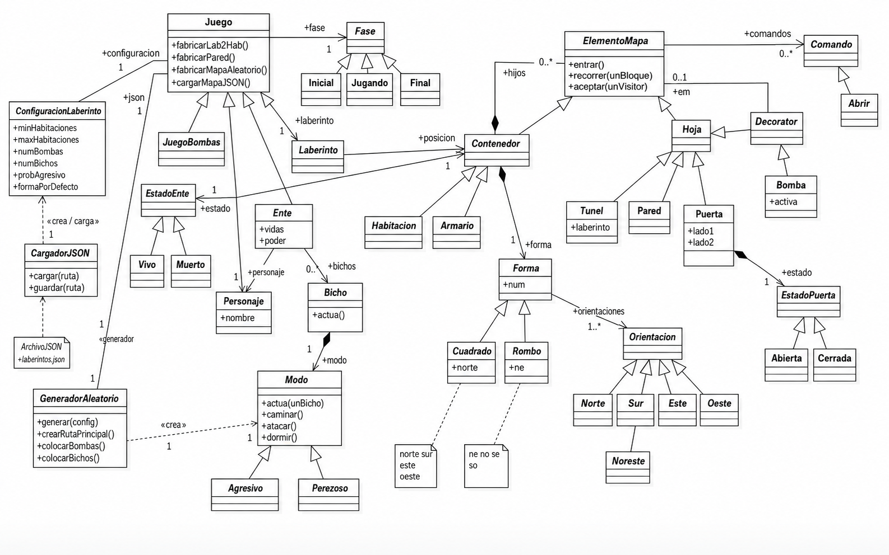
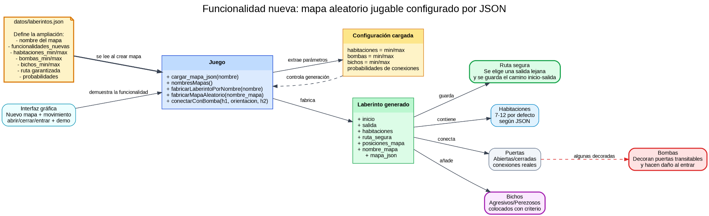

<div align="center">

# 🧩 Laberinto26

### Juego de laberinto en Python aplicando patrones de diseño


**Autor:** Alejandro Ortega Mendoza  
**Asignatura:** Diseño de Software  
**Repositorio:** `Laberinto26`

</div>

---

## 📌 Índice

- [Descripción](#-descripción)
- [Versión 3.0](#-versión-30)
- [Objetivo del juego](#-objetivo-del-juego)
- [Mapas aleatorios](#-mapas-aleatorios)
- [Diagramas de la ampliación](#-diagramas-de-la-ampliación)
- [Estructura del proyecto](#-estructura-del-proyecto)
- [Cómo ejecutar](#-cómo-ejecutar)
- [Cómo jugar](#-cómo-jugar)
- [Clases principales](#-clases-principales)
- [Patrones de diseño usados](#-patrones-de-diseño-usados)
- [Autor](#-autor)

---

## 🎮 Descripción

**Laberinto26** es un juego de laberinto desarrollado en **Python** para la asignatura de **Diseño de Software**.

El jugador controla un personaje que debe avanzar por distintas habitaciones hasta encontrar la salida.  
Durante la partida puede encontrarse con puertas, paredes, bombas, túneles y bichos.

El proyecto está dividido en clases y carpetas para representar los elementos del dominio y los patrones vistos en clase.

---

## 🚀 Versión 3.0

Esta versión mejora el juego para que cada partida sea diferente.
La versión 3.0 incluye:
- generación aleatoria de laberintos,
- configuración mediante JSON,
- ampliación de la interfaz gráfica,
- nuevas pruebas funcionales,
- mejoras en la estructura del proyecto.

### Cambios principales

- Cada vez que se pulsa **Nuevo mapa** se genera un laberinto distinto.
- Los mapas ya no son siempre iguales.
- El mapa puede tener entre 7 y 12 habitaciones.
- La salida se coloca en una habitación alejada del inicio.
- Siempre se genera una ruta principal posible para ganar.
- Las bombas ya no aparecen en todas las puertas.
- Ahora se garantiza que haya bombas en el mapa, pero colocadas en puertas transitables.
- Las bombas aparecen en puertas que se pueden usar, no en paredes sin recorrido.
- El panel de abrir puertas ahora muestra solo las puertas cerradas de la habitación actual.
- El botón de abrir se desactiva cuando no hay puertas cerradas cerca.
- Los bichos ahora tienen más sentido dentro del juego: algunos custodian la ruta hacia la salida y otros se mueven por zonas secundarias.
- Los bichos agresivos persiguen al jugador cuando hay camino disponible.
- Se añade un cartel central de **HAS MUERTO** cuando el personaje pierde todas las vidas.
- El cartel de muerte tiene un botón para **Volver a jugar**.
- Se mantiene la versión por consola.
- Se mantiene la versión visual con botones y registro de eventos.
- La configuración de la ampliación se guarda en `datos/laberintos.json` y es leída por el juego.

---

## 🎯 Objetivo del juego

El objetivo es llegar desde la habitación inicial hasta la habitación final sin que el personaje muera.

Durante el recorrido hay que tener en cuenta:

- algunas puertas están abiertas;
- otras puertas están cerradas y hay que abrirlas;
- las paredes bloquean el paso;
- las bombas pueden hacer daño;
- los bichos pueden atacar o moverse;
- el jugador puede atacar a los bichos.

---

## 🗺️ Mapas aleatorios

En esta versión el laberinto se genera de forma distinta en cada partida.

El juego crea automáticamente:

- varias habitaciones;
- una habitación inicial;
- una habitación de salida;
- una ruta principal para poder ganar;
- conexiones secundarias;
- algunas puertas cerradas;
- algunas bombas;
- bichos colocados con sentido dentro del recorrido.

La ruta principal no está llena de bombas, por lo que el juego se puede superar.  
Aun así, en el mapa siempre aparecen bombas colocadas en algunas puertas para que exista riesgo sin hacer la partida imposible.

---

## 🧩 Diagramas de la ampliación

### Diagrama completo actualizado

Este diagrama muestra la estructura general del proyecto con la ampliación añadida sobre el diseño base del laberinto.



---

### Diagrama de la funcionalidad nueva

Este diagrama resume la funcionalidad nueva de la versión 3.0: generación de mapas aleatorios jugables configurados mediante JSON.



---

## 📁 Estructura del proyecto

```text
Laberinto26/
├── main.py
├── main_gui.py
├── README.md
├── .gitignore
├── tests_pruebas_ampliacion.py
├── docs/
│   └── imagenes/
│       ├── diagrama_completo_funcionalidad_nueva.png
│       └── diagrama_funcionalidad_nueva.png
├── datos/
│   └── laberintos.json
├── interfaz/
│   ├── __init__.py
│   └── interfaz_laberinto26.py
└── modelo/
    ├── __init__.py
    ├── armario.py
    ├── bicho.py
    ├── bomba.py
    ├── builder.py
    ├── comandos.py
    ├── contenedor.py
    ├── decorador.py
    ├── direcciones.py
    ├── elemento_mapa.py
    ├── ente.py
    ├── estado_ente.py
    ├── estado_puerta.py
    ├── factorias.py
    ├── fases.py
    ├── formas.py
    ├── habitacion.py
    ├── hoja.py
    ├── interprete.py
    ├── iterador.py
    ├── juego.py
    ├── laberinto.py
    ├── modos.py
    ├── pared.py
    ├── personaje.py
    ├── puerta.py
    ├── tunel.py
    └── visitante.py
```

---

## 📄 Archivos importantes

- `interfaz/interfaz_laberinto26.py`: interfaz gráfica principal del proyecto.
- `main_gui.py`: punto de entrada de la versión visual.
- `main.py`: punto de entrada de la versión por consola.
- `datos/laberintos.json`: configuración de la ampliación y parámetros del mapa aleatorio.
- `tests_pruebas_ampliacion.py`: pruebas básicas de la ampliación.
- `docs/imagenes/diagrama_completo_funcionalidad_nueva.png`: diagrama completo actualizado del proyecto.
- `docs/imagenes/diagrama_funcionalidad_nueva.png`: diagrama específico de la funcionalidad nueva.

---

## ⚙️ Cómo ejecutar

### Versión por consola

```bash
python main.py
```

### Versión visual

```bash
python main_gui.py
```

---

## 🕹️ Cómo jugar

El jugador puede usar los botones de la ventana o escribir comandos.

### Comandos disponibles

| Comando | Acción |
|---|---|
| `norte` / `n` | Mover al norte |
| `sur` / `s` | Mover al sur |
| `este` / `e` | Mover al este |
| `oeste` / `o` | Mover al oeste |
| `noreste` / `ne` | Mover al noreste |
| `noroeste` / `no` | Mover al noroeste |
| `sureste` / `se` | Mover al sureste |
| `suroeste` / `so` | Mover al suroeste |
| `abrir norte` | Abrir una puerta al norte |
| `abrir este` | Abrir una puerta al este |
| `atacar` | Atacar a un bicho de la habitación actual |
| `mapa` | Mostrar información del mapa |
| `ayuda` | Mostrar los comandos |
| `salir` | Terminar la partida |

---

## 👾 Sentido de los bichos

Los bichos no están puestos al azar solo como decoración.  
En esta versión algunos pueden aparecer en la ruta hacia la salida para obligar al jugador a decidir si avanza, ataca o cambia de camino.

- Los bichos agresivos intentan acercarse al jugador.
- Los bichos perezosos pueden quedarse vigilando o moverse de vez en cuando.
- El jugador puede atacar si coincide con un bicho en la misma habitación.
- La partida sigue siendo posible porque la ruta principal no se bloquea con bombas en todas las puertas.

---

## 💣 Bombas

Las bombas están colocadas en puertas del laberinto.  
De esta forma tienen sentido dentro de la partida, porque el jugador puede encontrarlas al avanzar por caminos reales del mapa.

- No todas las puertas tienen bomba.
- Las bombas no se colocan en todas las paredes.
- Hay al menos dos bombas por mapa.
- La partida sigue siendo posible porque el personaje tiene varias vidas y no todas las rutas están llenas de bombas.

---

## 🚪 Apertura de puertas

La interfaz muestra las puertas de la habitación actual de forma más clara.

- Si hay puertas cerradas cerca, aparecen en el selector de abrir.
- Al pulsar **Abrir puerta**, se abre la dirección seleccionada.
- Si no hay puertas cerradas, el botón queda desactivado.
- Las puertas abiertas se muestran como rutas disponibles.
- Las puertas cerradas se indican para que el jugador sepa qué puede abrir.

Esto evita tener que probar direcciones al azar.

---

## 🧱 Clases principales

### Juego

La clase `Juego` centraliza la partida.  
Se encarga de crear el laberinto, gestionar el personaje, procesar acciones y comprobar si se ha ganado o perdido.

### Fase

Representa el estado general de la partida.

Clases relacionadas:

- `Inicial`
- `Jugando`
- `Final`

### ElementoMapa

Es la clase base de los elementos del mapa.

A partir de ella aparecen:

- `Contenedor`
- `Hoja`
- `Habitacion`
- `Laberinto`
- `Pared`
- `Puerta`
- `Bomba`
- `Tunel`

### Ente

Representa los seres del juego.

Clases relacionadas:

- `Personaje`
- `Bicho`

### EstadoEnte

Representa si un ente está vivo o muerto.

Clases relacionadas:

- `Vivo`
- `Muerto`

### EstadoPuerta

Representa si una puerta está abierta o cerrada.

Clases relacionadas:

- `Abierta`
- `Cerrada`

### Modo

Representa la forma de actuar de un bicho.

Clases relacionadas:

- `Agresivo`
- `Perezoso`

### Forma

Representa la forma de una habitación.

Clases relacionadas:

- `Cuadrado`
- `Rombo`

### Orientacion

Representa las direcciones posibles del laberinto.

Ejemplos:

- `Norte`
- `Sur`
- `Este`
- `Oeste`
- `Noreste`
- `Sureste`

### Comando

Representa acciones que puede ejecutar el jugador.

Ejemplos:

- `Abrir`
- `Mover`
- `Atacar`
- `Salir`

---

## 🧠 Patrones de diseño usados

### Composite

Se usa para representar elementos simples y compuestos del mapa.

Ejemplo:

- `ElementoMapa`
- `Contenedor`
- `Hoja`
- `Habitacion`
- `Laberinto`

Una habitación puede contener otros elementos, y el laberinto contiene habitaciones.

---

### Decorator

Se usa para añadir comportamiento adicional a un elemento del mapa.

Ejemplo:

- `Decorator`
- `Bomba`

Una bomba puede envolver una pared o una puerta para añadir el efecto de daño.

---

### State

Se usa para representar cambios de estado.

Ejemplos:

- una puerta puede estar `Abierta` o `Cerrada`;
- un ente puede estar `Vivo` o `Muerto`;
- el juego puede estar en fase `Inicial`, `Jugando` o `Final`.

---

### Strategy

Se usa para cambiar el comportamiento de los bichos.

Ejemplo:

- `Agresivo`
- `Perezoso`

Cada modo define una forma distinta de actuar.

---

### Factory Method

Se usa para centralizar la creación de elementos del juego.

Ejemplos:

- `fabricarHabitacion`
- `fabricarPared`
- `fabricarPuerta`
- `fabricarBomba`
- `fabricarBicho`

---

### Command

Se usa para representar órdenes del jugador como objetos.

Ejemplos:

- moverse;
- abrir;
- atacar;
- mostrar mapa;
- salir.

---

### Interpreter

Se usa para transformar el texto escrito por el usuario en comandos del juego.

Ejemplos:

```text
abrir este
norte
atacar
mapa
```

---

### Facade

La clase `Juego` funciona como punto principal de acceso al sistema.

Desde fuera no hace falta conocer todos los detalles internos del laberinto, las puertas, los bichos o los estados.  
La clase `Juego` ofrece una forma más sencilla de usar todo el conjunto.

---

## 👤 Autor

**Alejandro Ortega Mendoza**  
Estudiante de Ingeniería Informática  
Proyecto realizado para la asignatura de **Diseño de Software**.

---

<div align="center">

### 🧩 Laberinto26

**Versión 3.0**

</div>
